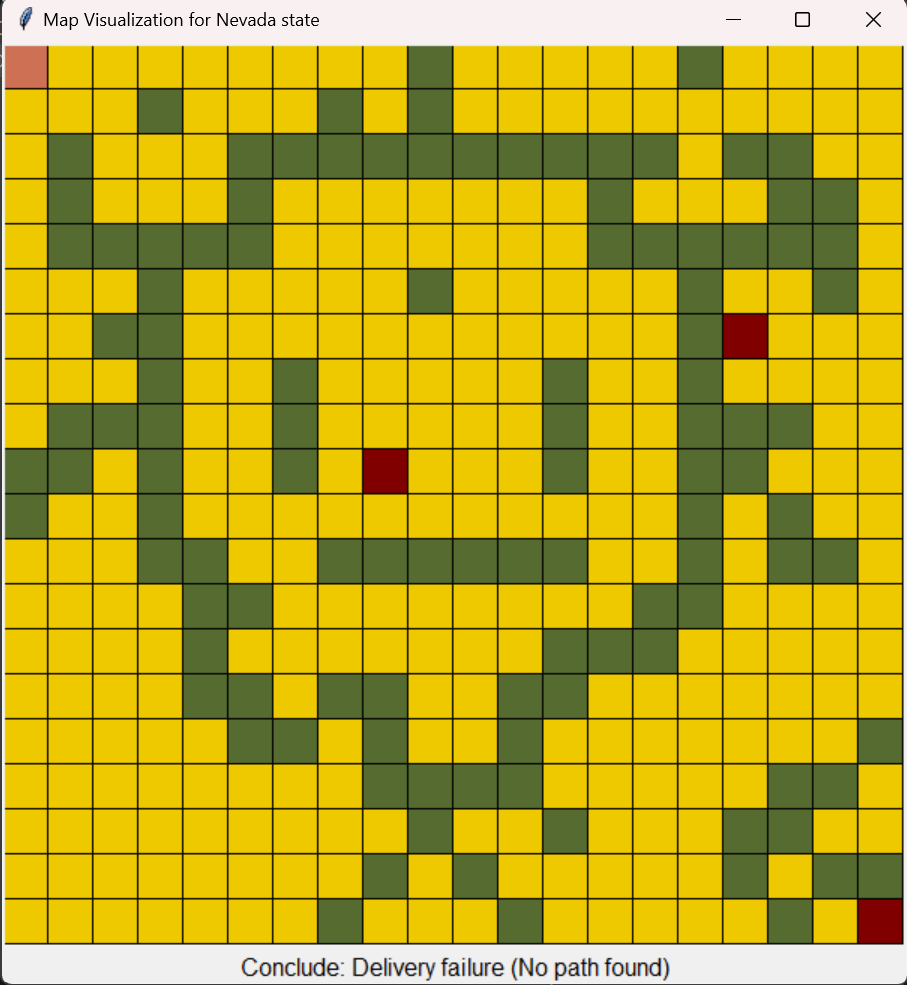
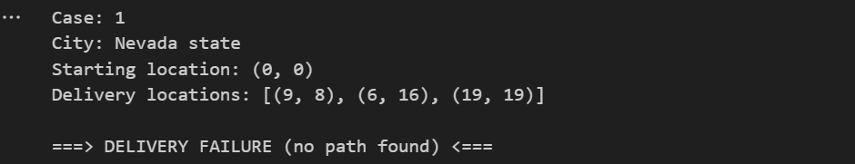
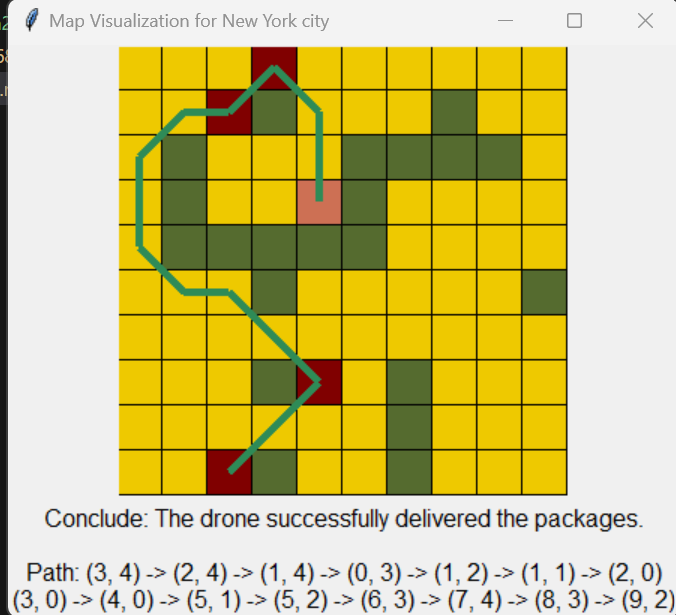
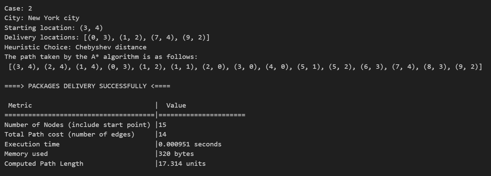
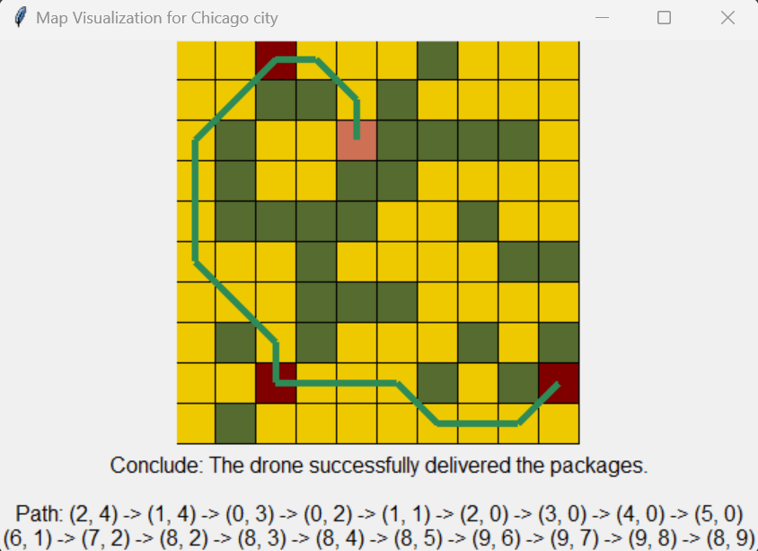
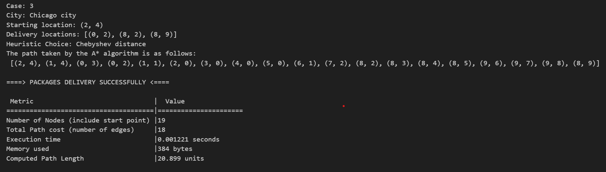
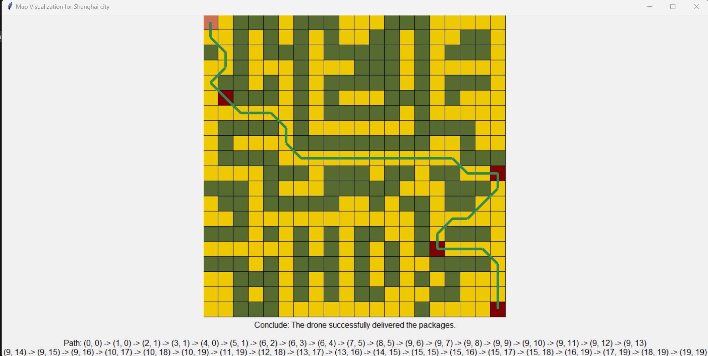
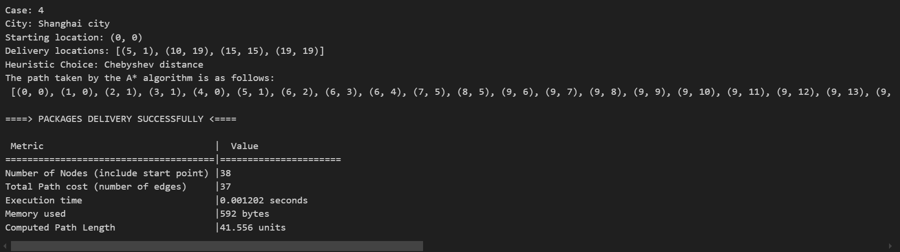

# A-Algorithm-for-Multi-Address-Drone-Delivery-in-a-Grid-Based-City-Map 🚁
     
Welcome to the repository! This project serves as the Assignment 2 source code 
for COSC2968|COSC3053 Foundation of Artificial Intelligence for STEM course.

## Introduction 📋

Suppose you are employed by a delivery company that uses drones to deliver packages. Your job is to create an AI program that uses the A* (A star) algorithm to determine the optimal flight paths for delivery drones.
Throughout a metropolis, the drone must deliver packages to several addresses. The city is shown as a grid map, with each cell denoting an open or restricted area. Obstacles such as towering buildings, trees, and airports are known as blocked cells, and they prevent drones from entering them. 

## Result Overview ✅
### Case 1: Nevada Stage
|<a href='#'>|<a href='#'>|
| :---: | :---: |
| Optimal Delivery Path Visualization | Analyse Delivery Path |

### Case 2: New York City
|<a href='#'>|<a href='#'>|
| :---: | :---: |
| Optimal Delivery Path Visualization | Analyse Delivery Path |

### Case 3: Chicago City
|<a href='#'>|<a href='#'>|
| :---: | :---: |
| Optimal Delivery Path Visualization | Analyse Delivery Path |
### Case 4: Shanghai City
|<a href='#'>|<a href='#'>|
| :---: | :---: |
| Optimal Delivery Path Visualization | Analyse Delivery Path |

## Getting Started 🚀

To begin, you'll need to install python 3.12.4, VSCode with all Jupyter extensions installed.
- Run from source code:
1. Clone this repository to your local machine using VSCode as your IDE.
2. Read through User Instuction to run the program successfully.
3. Explore the functionalities and provide feedback for improvements.

## Author 👨‍💻

- [Hoang Minh Thang](https://github.com/ThangHoang54)

## Technologies Used 🤖

    

## Addition Note 📱
**The provided code includes the following notes:**
1. In this program, the location point (address) is represented by coordinates (x, y). Where:

 > 
x is the distance of this point along the row-axis from the original.

 > 
y is the distance of this point along the column-axis from the original.

2. This visualization map does not have its legend display next to since the Tkinter library does not provide any related built-in functions. Instead, **the legend will be represented in section IV**.  
3. The analysis of the solution's efficiency will be displayed in the corresponding console.

## Acknowledgments 🙏

Special thanks to the course instructors for providing guidance and resources for this assignment.
Additionally, gratitude to all contributors and users who help improve the system through feedback and suggestions.

Thank you for visiting the A-Algorithm-for-Multi-Address-Drone-Delivery-in-a-Grid-Based-City-Map repository. Happy coding! 🎉
